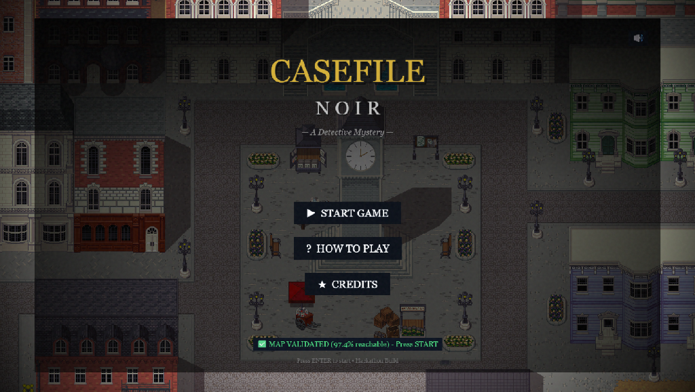

# 🕵️ Casefile Noir

<div align="center">



**A noir detective RPG powered by Gemini AI**

Built for the **Gemini 3 Hackathon** | [Play Demo](#-quick-start) | [Features](#-features)

[](https://phaser.io/)
[](https://ai.google.dev/)
[](LICENSE)

</div>

---

## 📖 About

**Casefile Noir** is an immersive top-down detective RPG that combines classic pixel art aesthetics with cutting-edge AI. Players step into the shoes of a 1940s detective, investigating crimes by collecting evidence, interrogating suspects, and using **Gemini AI** to detect contradictions and solve cases.

### 🎯 Built For
This project was created for the **Gemini 3 Hackathon**, showcasing how AI can enhance gameplay through:
- **Dynamic contradiction detection** using Gemini's reasoning capabilities
- **Intelligent NPC dialogue** generation
- **Context-aware evidence analysis**

---

## ✨ Features

### 🎮 Core Gameplay
- **Top-down RPG exploration** with smooth WASD/Arrow key controls
- **Evidence collection system** with interactive notebook UI
- **Suspect interrogation** with branching dialogue trees
- **AI-powered contradiction detection** that analyzes player-collected evidence against suspect statements

### 🎨 Visual & Audio
- **Atmospheric noir aesthetic** with rain effects and day/night cycles
- **Dynamic minimap** with full-screen toggle (press `M`)
- **Synthesized ambient soundtrack** with noir-themed background music
- **Grain & vignette post-processing** for authentic film noir feel

### 🤖 AI Integration
- **Gemini-powered logic engine** for case solving
- **Real-time contradiction analysis** between evidence and testimonies
- **Intelligent hint system** when players are stuck

### 🗺️ Technical Highlights
- **Procedural NPC spawning** with A* pathfinding
- **Advanced collision detection** with stair navigation
- **Tiled map integration** with 50+ custom layers
- **Responsive UI** with mobile-friendly controls

---

## 🚀 Quick Start

### Prerequisites
- Node.js 18+ 
- npm or yarn
- A Gemini API key ([Get one here](https://ai.google.dev/))

### Installation

1. **Clone the repository**
```bash
git clone https://github.com/yourusername/casefile-noir.git
cd casefile-noir
```

2. **Set up the backend**
```bash
cd server
npm install

# Create .env file
echo "GEMINI_API_KEY=your_api_key_here" > .env

npm run dev
```

3. **Set up the frontend**
```bash
cd ../client
npm install
npm run dev
```

4. **Open the game**
Navigate to `http://localhost:5173` in your browser

---

## 🎮 Controls

| Key | Action |
|-----|--------|
| `WASD` / `Arrow Keys` | Move detective |
| `E` | Interact with evidence/NPCs |
| `M` | Toggle full-screen map |
| `F7` | Toggle minimap visibility |
| `K` | Mute/unmute audio |
| `F2` | Toggle debug overlay |
| `F3` | Toggle physics debug |
| `F4` | Toggle NPC debug markers |

---

## 🏗️ Tech Stack

### Frontend
- **Phaser 3** - Game engine
- **Tiled** - Map editor
- **Vite** - Build tool
- **Web Audio API** - Synthesized music

### Backend
- **Node.js + Express** - API server
- **Google Gemini API** - AI logic engine
- **Multer** - File upload handling

### Tools & Assets
- **Python scripts** - Sprite processing & map validation
- **Custom tileset** - Victorian-era pixel art
- **A* pathfinding** - NPC navigation

---

## 📂 Project Structure

```
casefile-noir/
├── client/                 # Frontend Phaser game
│   ├── src/
│   │   ├── scenes/        # Game scenes (StartMenu, Game, etc.)
│   │   ├── utils/         # Utilities (AudioManager, Minimap, etc.)
│   │   └── ui/            # UI components (Notebook, Evidence Modal)
│   ├── public/
│   │   └── assets/        # Sprites, maps, tilesets
│   └── index.html
├── server/                # Backend API
│   ├── routes/            # Express routes
│   ├── services/          # Gemini integration
│   └── server.js
└── README.md
```

---

## 🎯 How It Works

1. **Evidence Collection**: Players explore the Victorian city, interacting with objects marked with glowing indicators
2. **Interrogation**: NPCs can be questioned, with responses generated dynamically
3. **AI Analysis**: When ready, players submit their evidence to Gemini, which analyzes contradictions
4. **Case Resolution**: The AI provides hints or confirms the solution based on collected evidence

---

## 🤝 Contributing

This is a hackathon project, but contributions are welcome! Feel free to:
- Report bugs via Issues
- Suggest features
- Submit pull requests

---

## 📜 License

This project is licensed under the MIT License - see the [LICENSE](LICENSE) file for details.

---

## 🙏 Acknowledgments

- **Google Gemini Team** for the incredible AI API
- **Phaser Community** for excellent documentation
- **Tiled Map Editor** for the powerful tilemap tools
- **OpenGameArt** for inspiration on pixel art assets

---

<div align="center">

**Made with ☕ and 🎮 for the Gemini 3 Hackathon**

[⬆ Back to Top](#-casefile-noir)

</div>
